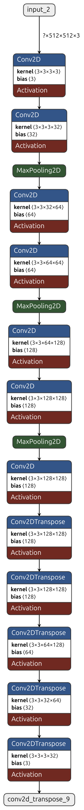
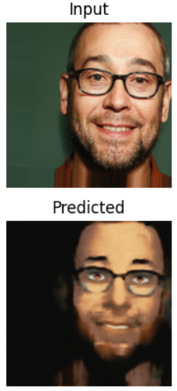

## Overview
This project implements an **Encoder-Decoder Model** to transform images into their cartoon versions. The model leverages deep learning techniques to extract meaningful features from an image and generate a stylized cartoon-like output.

## Features
- Converts real-world images into cartoon-style illustrations
- Uses an Encoder-Decoder architecture for efficient image transformation
- Supports GPU acceleration for faster inference

## Installation
Clone the repository and install the required dependencies:
```bash
git clone https://github.com/navin123456789/Image_Cartoonize.git
pip install -r requirements.txt
```

## Model Architecture
The model follows an **Encoder-Decoder** approach:
1. **Encoder:** Extracts key features from the input image using convolutional layers.
2. **Decoder:** Reconstructs the image into a cartoonized version with stylization.



## Installation
#### Requirements
- `>python 3.9.15`
- `>tensorflow 2.10.0`
- `numPy`
- `matplotlib`


### Uses
you can install the required packages and start using the already trained model. You can access the model using the by importing the file `predict.py` and use the fuction `get_prediction` to get the cartoon version of the image.

If you want to train the model on your own dataset, you can use the `model.py` file to train the model on youe own dataset.

Before training the model, you need to structure the dataset in the following way:

```
data/
    train/
        real/
        images
        ...

        cartoon/
        images
        ...

    validation/
        real/
        images
        ...

        cartoon/
        images
        ...

    test/
        real/
        images
        ...

        cartoon/
        images
        ...
```

## Datasets

The dataset used for training the model is the Comic Faces Paired Synthetic V2 dataset. The dataset contains 10000 images of real faces and their corresponding comic versions. The dataset is available on Kaggle and can be downloaded from the following link:

<https://www.kaggle.com/datasets/defileroff/comic-faces-paired-synthetic-v2>

## Training Details
- Epochs: 35
- Batch Size: 16
- Optimizer: Adam
- Loss: Mean Squared Error
- Hardware: NVIDIA GeForce RTX 4060 Laptop GPU

## Results


The above result shows the input image and its corresponding cartoon version generated by the model. While training the model, it had the loss of 0.12. The model is able to generate the cartoon version of the input image with acceptable accuracy.


## Results
The model effectively generates cartoonized images with smooth edges and reduced color depth, enhancing the artistic effect.

## Future Improvements
- Improve edge detection and stylization
- Implement real-time video cartoonization
- Optimize model for mobile deployment

## Contributing
Feel free to contribute to the project by opening issues and pull requests.

## Contact
For any queries, contact: navingyawali788@gmail.com

